# CUDA Path Tracer

**University of Pennsylvania, CIS 565: GPU Programming and Architecture, Project 3**

&nbsp;Avi Serebrenik

&nbsp;\* [LinkedIn](https://www.linkedin.com/in/avi-serebrenik-a7386426b), [Personal Website](https://aviserebrenik.wixsite.com/cvsite)

&nbsp;\* Tested on: Windows 11, i7-13620H @ 2.4GHz 32GB, RTX 4070 8GB (Laptop)

## Overview

  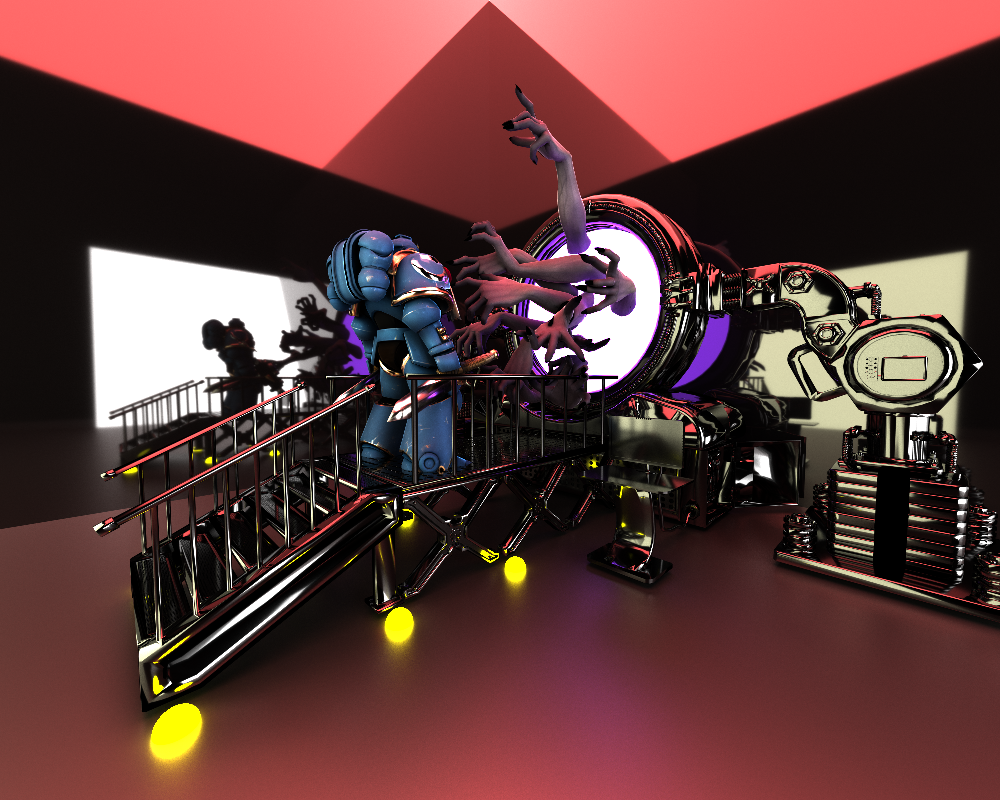
   
  <em>"Time" rendered at 2000x1600 with 5000 iterations and a bounce depth of 12</em>

This Path Tracer was built with C++ and CUDA, with the code having the following top-level structure, where the first two and the last are done once per scene; 3, 4, and 9 are called once per iteration; and 4-8 are called once per bounce:
 1. Import scene information from a JSON file, which includes basic materials, their positions and transformation matrices, and the paths for any external gLTF meshes with attached transformation matrices.
 2. Convert this scene information into CUDA-readable formats and structs.
 3. Call any needed information in the main path tracing function.
 4. Start the path tracing loop by first calculating a ray from the camera through each pixel via a kernel.
 5. Using a computeIntersect kernel, check for the closest intersection from that ray and set the intersection information accordingly.
 6. If enabled, sort intersections and rays by material information.
 7. Calculate the color information and the next bounce direction of each ray in separate or one unified kernel.
 8. If enabled, use stream compaction to do away with rays that have terminated their bounces and repeat the path tracing loop if we have bounces and rays left.
 9. Post loop, use this loop's information to add to the information in the scene.
 10. Post tracing, clean up the memory, and save the final image to a file.

Beyond these features, I also added the following, which I will describe and analyze the results of below:
 * Supporting diffuse, specular, transmissive, dielectric, and PBR (using a GGX Microfacet model).
 * Stochastic Sampled anti-aliasing.
 * Supporting JSON primitives (spheres and boxes), and gLTF mesh imports with external (non-binary) textures using the tinygLTF library.
 * Depth of Field
 * .hdr environment maps
 * Bounding Volume Hierarchies using a Surface Area Heuristic for much faster runtime improvements and binned construction for much faster pre-process building.
 * Stream Compaction
 * Material Sorting
 * Various ImGui features to toggle all of these above, display runtime information, and toggle channels for swapping between the scene, its albedo, its metal-roughness, its BVHs, its normals, or its depth. (ignore this graders lol, this was done after the PR)

## Methods

### Material Evaluation

  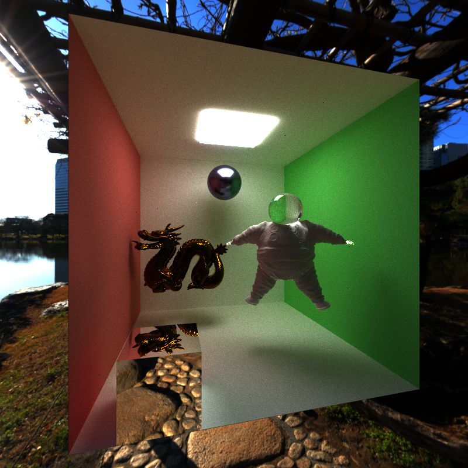
   
  <em>"Cornell Showcase" showing off supported materials. Rendered at 800x800 with 5000 iterations and a bounce depth of 8.</em>

This one is based on my earlier path tracer in OpenGL, and uses much of the same code ported over to CUDA, so I will be focusing on their implementation over the theory.
In order to easily support the sorted and unsorted versions, each material has a kernel, but the kernels all just call their respective inline functions, so the one big unsorted kernel can share that too.
These kernels and their inline functions can be found in utils.cuh and utils.cu.

**Diffuse** uses cosine weighted hemisphere sampling to give us a random bounce direction and easy calculations.\
**Specular** simply gives us perfect refraction along the intersection's surface normal and doesn't add material color to the path.\
**Transmissive** took a while to fully port here, which turned out to be mainly the fault of a given sphere intersection code that I had to then modify, but relies on Snell's Law by using glm::refract. One of the indices of reflection is presumed to be air aka 1.0, and the other needs to be encoded in the material. This means I don't support transmission between two non-air materials. I made this choice because this would only be a small fraction of all cases and would need some extra information to be stored for each ray, slowing down everything else.\
**Dielectric** combines specular and transmissive materials. I decide which material to use via a random number generator and a probability of chosing specular over transmissive which is encoded in the material information. I then attenuate the results by 2 to account for this, and a Fresnel Dielectric Evaluation helper function.\
**PBR** materials use a GGX/Trowbridge-Reitz Microfacet model. This alone took up multiple times the work as the others combined, as simply "porting it over to CUDA" as I mentioned above didn't work... After getting all the encoded material information and checking for material maps, I first determine the incoming ray direction (wi) by using a similar probability-based split between purely diffuse materials (which I handle with a simple hemisphere check) and the rest, which I handle with GGX importance sampling. Next, I calculate the BRDF with a helper function that uses a Trowbridge-Reitz function to calculate the Distribution term, a Schlick approximation for the F term, and the Smith approximation for the Geometry term for the specular component. The diffuse component is quite standard and incorporates the metallic factor, and I simply lerp them together using the F term (which becomes kS). For the PDF, I use the same Trowbridge-Reitz function for the D term to calculate the specular component, and I use the Fresnel Schlick approximation to come up with a specular probability value that I use to simply lerp between this specular and a diffuse component, similarly to the BRDF. Importantly, I found that the roughness needs to be clamped between 0.05 and 1 or 0.95, depending on the situation, to avoid some floating-point errors and weird outputs. However, as can be seen in the image below, the final result doesn't suffer from this clamping.

  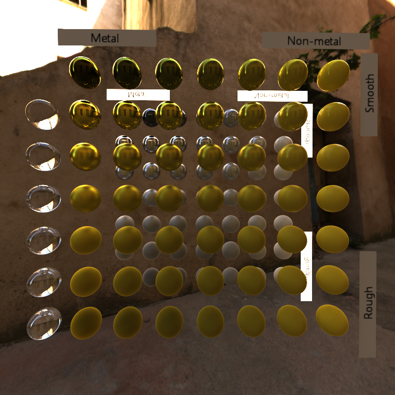
   
  <em>"PBR and Dielectric Showcase". The dielectric spheres have a varying IOR, starting at 1 (air) and increasing by 0.25 until 2.5 at the end. Rendered at 800x800 with 5000 iterations and a bounce depth of 8.</em>

### Stochastic Sampled Anti-Aliasing
This method is quite short and easy to implement and offers great results and basically 0 performance cost. Instead of shooting our rays through the very center of each pixel, leaving a pixel's distance between each neighboring one, we can simply randomly offset--jitter--them within these pixels to create variable distances that do away with these harsh pixel edges. To implement this, I just created a random x and y offset in the range [-0.5, 0.5] and added them to my coordinates before translating them into pixel space. The results speak for themselves:
<table align="center">
  <tr>
    <td align="center">
      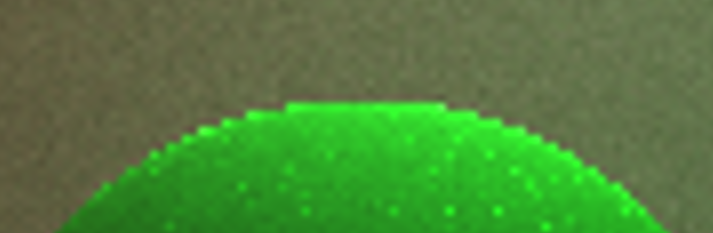
       
      <em>Edge of sphere with no anti-aliasing</em>
    </td>
    <td align="center">
      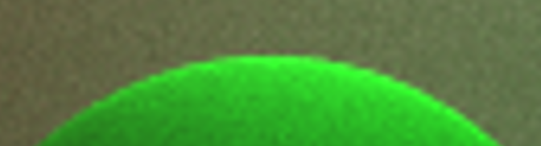
       
      <em>Edge of sphere with stochastic anti-aliasing</em>
    </td>
  </tr>
</table>

### Object and Texture Importing
The JSON parsing relies on the nlohmann JSON library to easily access the information, and then this is parsed in the Scene class's loadFromJSON function. Each material needs to have some specific basic tags, and all of my JSON scenes can be viewed in the scenes folder. For a good example of multiple different materials and objects, I would recommend looking at "cornellShowcase.json," which is the scene shown at the top of the material evaluation section. Most of this functionality was given in the base code for this project, and I only added the specific materials and their parameters, and the GLTF array field. This array holds a string for a gLTF file path to read from and a rotation, translation, and scale vector to properly fit these into a scene. In the loadFromJSON function, these are simply all loaded in, and then later I call the loadFromGLTF function. This latter function uses two different classes, which are both in GLTFManager.h and GLTFManager.cu, called GLTFLoader and GLTFManager. The first one is really for calling the tinygLTF library and getting all the content in a nice format for me to read. It stores temporary things so I can delete all of them by the time I actually pathtrace. The GLTFManager, on the other hand, does the more in-depth processes of creating proper triangles, creating the material array that these triangles will reference, and managing my BVH nodes (more on those later). It also handles copying everything to the device from the host and clearing all that at the end of the process. Since I support multiple gLTFs, this is done sequentially, one by one, to make sure nothing gets tangled up, and then everything gets copied to the device. Textures also also read in at this point with a TextureLoader class, which is separate because it also handles environment map loading, and they use the cudaTextureObject_t class for copying them to the device and easy access from there. The output of each of these texture channels (for the Time scene) can be seen here:
<table align="center">
  <tr>
    <td align="center">
      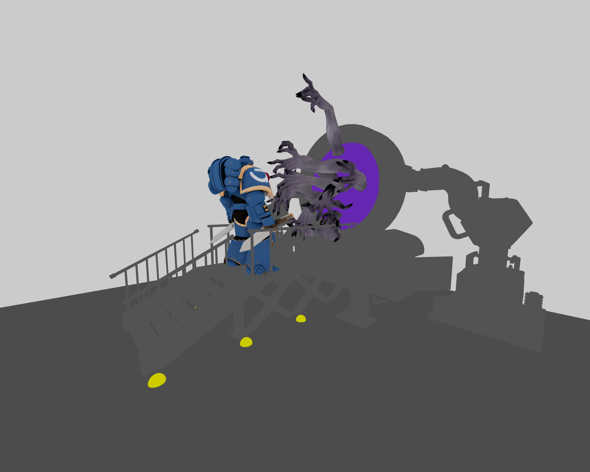
       
      <em>Albedo</em>
    </td>
    <td align="center">
      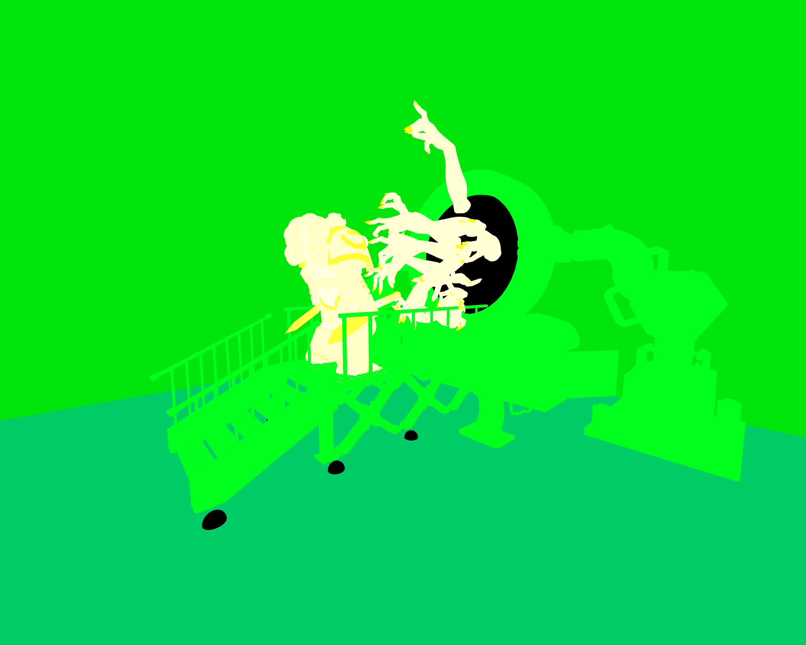
       
      <em>Metal Rough Mask</em>
    </td>
        <td align="center">
      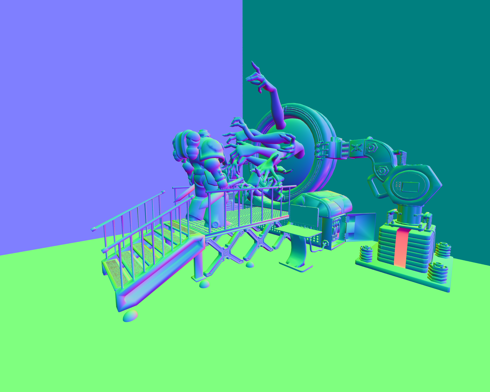
       
      <em>Normal</em>
    </td>
  </tr>
</table>
And for reference, here is the Metal Rough mask of the "PBR and Dielectric Showcase," where the non-dielectric spheres are imported from a gLTF.

  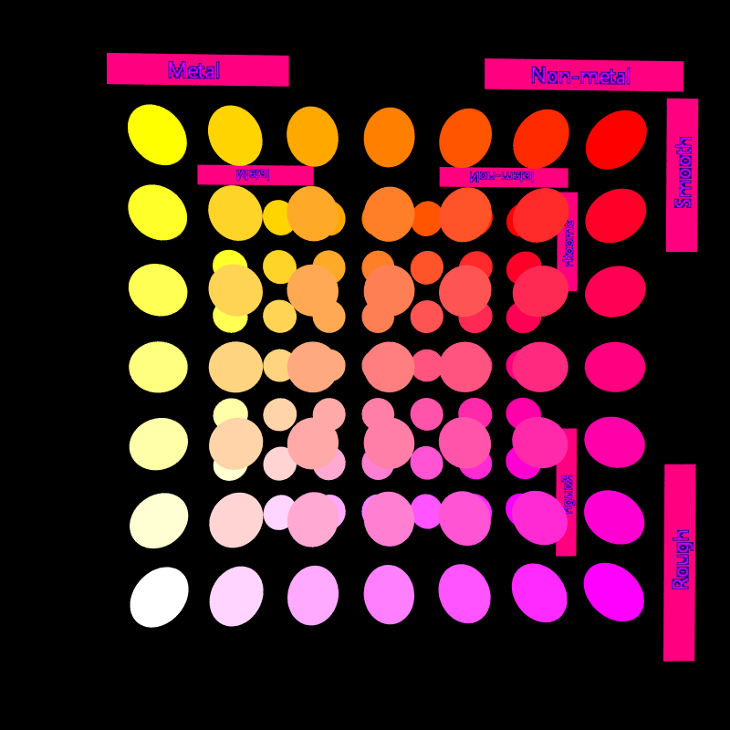
   
  <em>"PBR and Dielectric Showcase" Metal Rough Mask</em>

### Depth of Field
My implementation of Depth of Field follows the physically based depth of field [PBRT book article](https://pbr-book.org/4ed/Cameras_and_Film/Projective_Camera_Models#TheThinLensModelandDepthofField) on it very closely. I simply added a focus distance and a lens radius variable to my camera, which can be set at runtime in the ImGui window, and instead of using a pinhole camera source, I jitter my ray origin to be on the lens. The performance overhead of this is negligible, as it is only a few extra calculations, but we get some very nice-looking results:
<table align="center">
  <tr>
    <td align="center">
      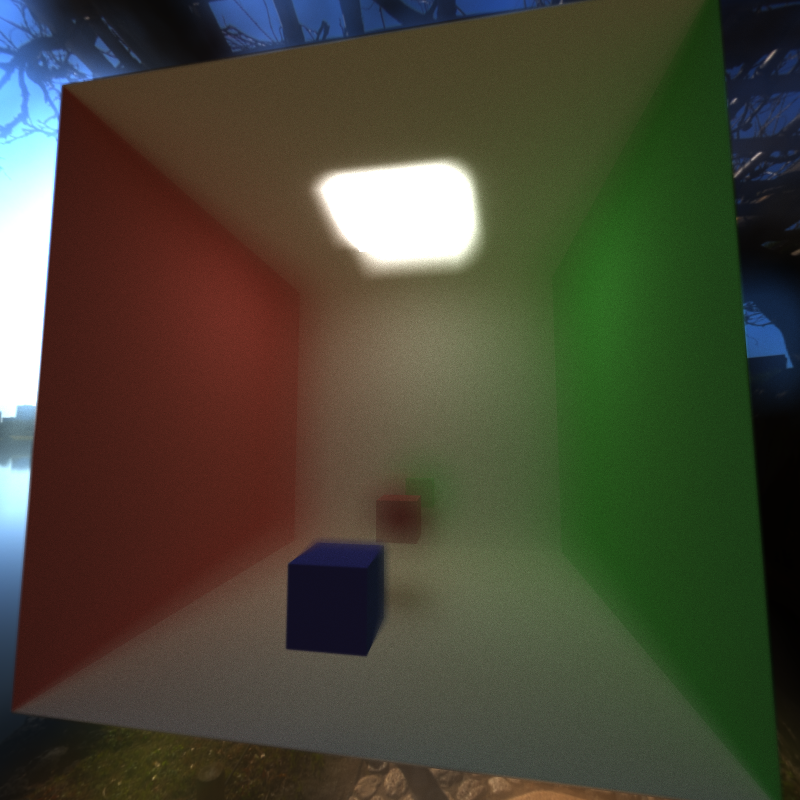
       
      <em>Depth of Field - Near</em>
    </td>
    <td align="center">
      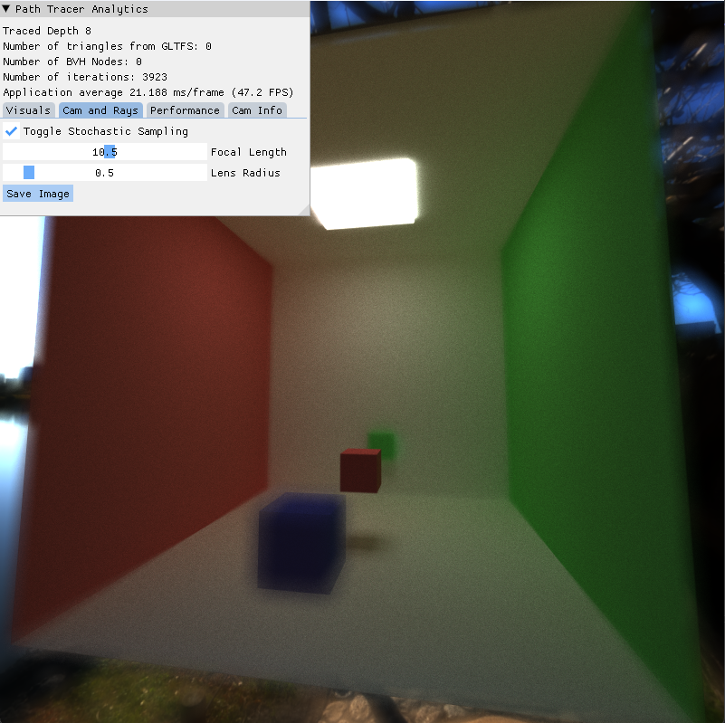
       
      <em>Depth of Field - Mid</em>
    </td>
        <td align="center">
      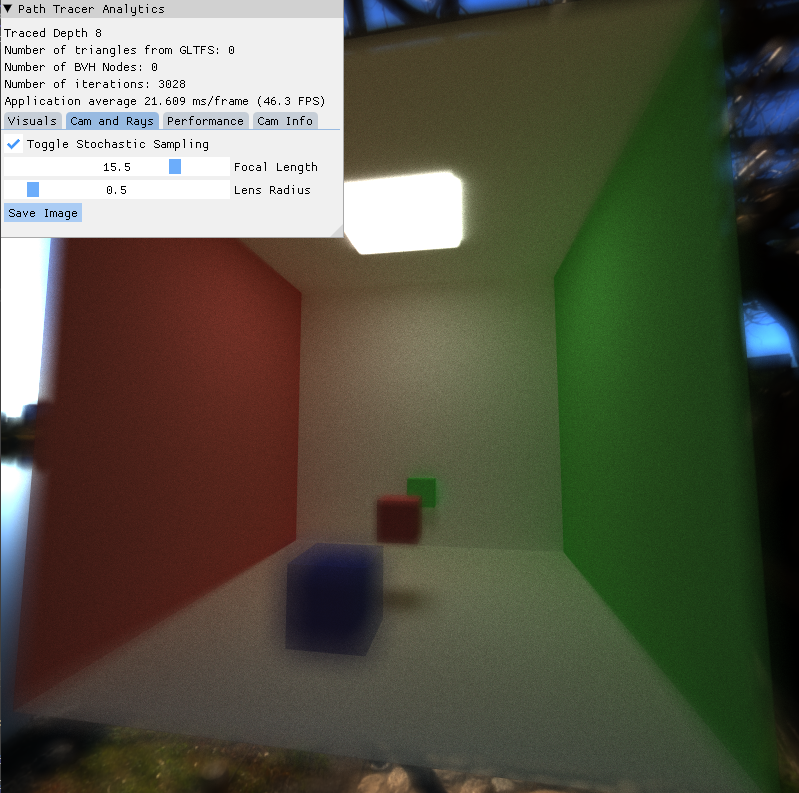
       
      <em>Depth of Field - Far</em>
    </td>
        </td>
        <td align="center">
      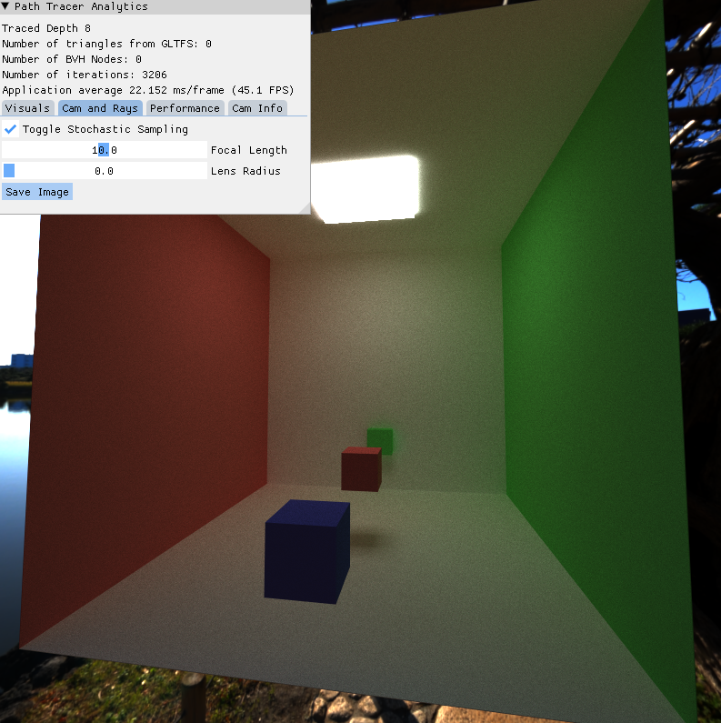
       
      <em>No Depth of Field</em>
    </td>
  </tr>
</table>

### Environment Maps
Environment maps can be swapped during runtime from an ImGui dropdown menu that just changes where the path is. If it is new, it frees up the current map and loads in the new one as a cudaTextureObject_t, so that at any given time we only need to store one environment map in memory. I decided on this approach because, as shown in the GIF below, the swap is quite fast, and I already has a lot of assets in memory. Loading them in is done with the Texture Loader class, same as the textures, but the actual function is a little different, since they are in High Dynamic Range and need some extra transformations. Unfortunately, I was unable to implement importance sampling or MIS for this project due to the limited time frame, so some of these environment maps create quite a few fireflies, but this is something that I will attempt to fix in the future.

  
   
  <em>"Dragons" in varying environment maps</em>

### Bounding Volume Hierarchy (BVH)

  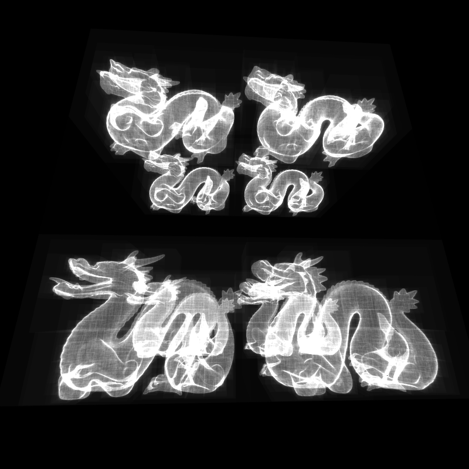
   
  <em>"Dragons" bounding volumes</em>

As most graphics people can tell, the GIF above has 4 Stanford Dragons in it, yet the scene still runs at about 20-30fps depending on the viewing angle. I'm tooting my own horn here, but that's pretty dang good for close to 7 million triangles! This is accomplished by bounding volumes in the shape of squares. Basically, we create a hierarchical bounding volume structure that encompasses the triangles in the scene. Each box, because I'm using boxes for the volumes, has two children, and only leaf BVH nodes contain actual triangles. Thus, when computing ray intersections, instead of checking against each triangle, we simply traverse down the BVH tree until we hit a leaf node, and then we only need to check the triangles within. Box intersections are very easy to compute, as each node stores a maximum and a minimum corner value, so we only need to check against a few planes. On the CPU, this intersection check would be recursive, but I employ a stack-based method as described in [this YouTube video](https://www.youtube.com/watch?v=C1H4zIiCOaI&start=553).
How does one construct a BVH? I used a [blog by "Jacco"](https://jacco.ompf2.com/2022/04/13/how-to-build-a-bvh-part-1-basics/) for this part of the code, but the basic naive implementation simply splits each bounding box along the largest axis to get each child. It subdivides recursively and terminates when there are two or fewer triangles in the box. This is a good starting point, but it does not get us ~25fps for 7million triangles, so I implemented some later parts of the blog to speed things up. First, the BVH nodes themselves become smaller, only storing the necessary information of their min and max values, the triangle count of this node, and a final value which is either the index of their left child node in the BVH array (knowing that the right is that +1) if the triangle count is 0 (i.e. if this is not a leaf node), or the index of the first child triangle if this is a leaf node. This optimization means that we need to sort the triangles, but that's easily done and allows these nodes to be only 32 bytes, allowing for a pair of sibling nodes to sit cozily on one 64-byte cache line. The speedup is worth it. Next, we move on from the naive subdivision to instead divide more evenly based on the probability of hitting a triangle in the box. We get this probability by checking the area of the triangles, since a larger area is the best predictor. However, this comes with a lot more calculations at build time (O(n^2) construction) to the point where my larger scenes like *Time* or *Dragons* never even built - or maybe they would eventually, but I got impatient. Thus, instead of checking every triangle when subdividing, we bin them (I stuck with 8 bins) using evenly spaced dividing lines, and then only checking within these bins. I believe this means that we won't get the fully optimal subdivisions, but instead of waiting forever, I now only need to wait a few seconds to construct these BVHs.For a quick comparison of what a Naive vs a Surface Area Heuristic (SAH) based assembly looks like, here is an image of each using the Stanford Dragon model. Can you tell which is which before looking at their description?

<table align="center">
  <tr>
    <td align="center">
      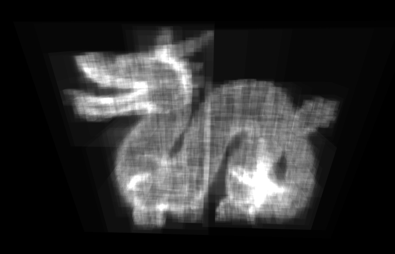
       
      <em>Stanford Dragon with Naive BVH construction</em>
    </td>
    <td align="center">
      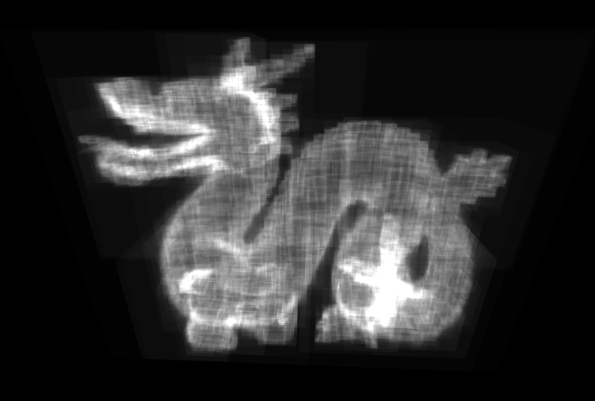
       
      <em>Stanford Dragon with SAH BVH construction</em>
    </td>
  </tr>
</table>

The differences seem minimal, but they're there in crucial spots. For example, notice the big box spanning the left side of the dragon in the naive version that isn't there in SAH. Similarly, notice the multiple overlapping boxes above the top part of the tail in the naive. These have massive empty areas that the SAH already does away with. Also, notice how on the left side, the two boxes are split higher in the naive version than in SAH. This is because there is much more detail and triangles in the feet of the dragon, so a more even split should be lower along the neck, as opposed to the naive, more distance-based split. These might seem like my nitpicking, but as I discuss in the Analysis section, the runtime difference is drastic. 

Finally, as I mentioned above, and as one can see in the GIF, the framerate of the *Dragons* scene varies based on viewing angle. This is because these BVHs are constructed before runtime and thus optimize for a general case. However, we have different triangle overlaps and setups from different angles. To optimize for this, one can traverse the BVH in a distance-based order when finding intersections, but my implementation of this was buggy, and I never got around to fixing it. This is something that I hope to do in the future. For a funny bug that I got while trying to implement this, please look at the Bloopers section.

### Stream Compaction
Since we loop over our paths multiple times (usually 8 for me), we want to get rid of paths that have already terminated. To do this, I simply partition my intersection and path arrays using thrust::partition and set the new number of paths accordingly. This usually gives a decent performance boost, as discussed in the Analysis section below.

### Material Sorting

  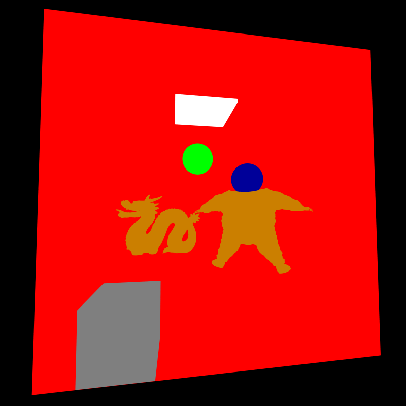
   
  <em>"Cornell Showcase" with the material channel, showing the differing materials on my code's side</em>

This was implemented as a potential performance speedup, the results of which are discussed below in the Analysis section. The way it is implemented is that since I already encode intersection material information as an ENUM, I simply use thrust::sort_by_key to sort my paths and intersections by treating the ENUMS as their integer value. Then, similarly to my grid sorting in my Boids project, I use a kernel to "unroll" this sorted array and get the start and end index of each material. I store these in a small array of size MaterialNumber, and then launch kernels for each material with a threadcount based on these results. I created a "None" material for terminated paths, which has the highest index, so it gets sorted to the end of my array. Thus, I can simply use the start index of this array to cut away these paths for my next loop, essentially giving me stream compaction for free.

### Imgui Features
*Note: I should add this part after grading is done, since most of this was done after my official PR.*

## Analysis
Before jumping in, here are the scenes and their stats that I am using for analysis. Most of these have popped up above in the showcase, since they display a variety of features, so I thought they would also be a varied enough collection for good performance analysis.

<table align="center">
  <tr>
    <td align="center">
      
       
      <em>Cornell Showcase</em>
    </td>
    <td align="center">
      
       
      <em>Time</em>
    </td>
    <td align="center">
      
       
      <em>PBR and Dielectric Showcase</em>
    </td>
    <td align="center">
      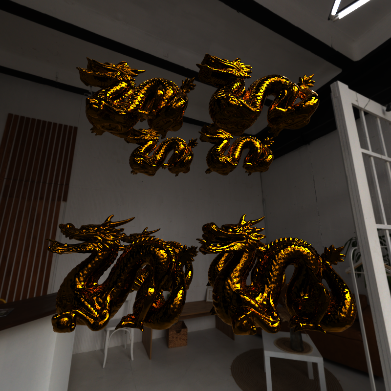
       
      <em>Dragons</em>
    </td>
    <td align="center">
      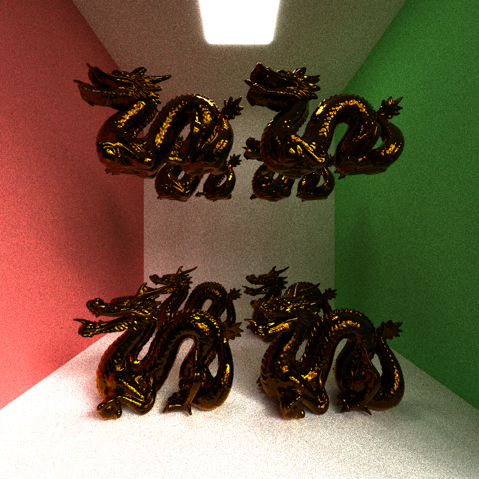
       
      <em>Dragons Box</em>
    </td>
  </tr>
</table>

| Name | Dimension | Triangles | SAH BVH Nodes | Naive BVH Nodes | Traced Depth |
|:-----:|:---------:|----------:|--------------:|----------------:|-------------:|
| Cornell Showcase (CS) | 800x800 | 1315991 | 2609273 | 1423557 | 8 |
| Time (T) | 2000x1600 | 479113 | 948991 | 44707 | 12 |
| PBR and Dielectric Showcase (PBR) | 800x800 | 501776 | 1001021 | 524093 | 8 |
| Dragons (D) | 800x800 | 6970448 | 13772339 | 7277053 | 8 |
| Dragons Box (DB) | 800x800 | 6970448 | 13772339 | 7277053 | 8 |

First, lets take a look at the effect of stream compaction and material sorting. I didn't combine the two since, as I mentioned above, compaction is done for free in my material sorting method. I measured the following parts of a single path tracing iteration for each:
 - Setting up the information needed, where we do some memory calls at the beginning of path tracing to get all our variables in order.
 - Generate rays, where we shoot the rays from the camera. This should only be dependent on the resolution, but showing this exposes the error rate in my time measurements.
 - Sort materials, i.e. material sorting if turned on.
 - Render materials, which is the actual ray shading and computation part.
 - Stream compact, if it is turned on.
I used a CUDA timer to measure each, so the timings themselves should be pretty accurate, but there is always variance between each frame and also each running of the scene due to my computer doing other processes in the background. Thus, I will focus more on general trends in the results rather than specific values.
If I were to chart the full comparison, it would look like this:

  
   
  <em>Comparison chart of everything</em>

As we can clearly see, material sorting takes up quite a bit of time, so much so, in fact, that we can't really make out any good data from this chart. However, what's interesting is that it even increases rendering time, which is what it's supposed to help with in the first place! This was quite odd to me, since there must be some reason why we would want to do this. To investigate, I set up two new scenarios based on my hypothesis that the reason for this slowdown was either that my extra start and end index checking was taking up too much time or that launching a higher number of kernels was taking up too much time. The first scenario is letting thrust do the only sorting, and I launch everything in one kernel afterwards, making the same material paths be grouped together in memory, but not doing any extra sorting. However, we lose my stream compaction here, so we keep re-checking worthless paths, which makes this incredibly slow. Thus, I next tested the same scenario with added stream compaction.

  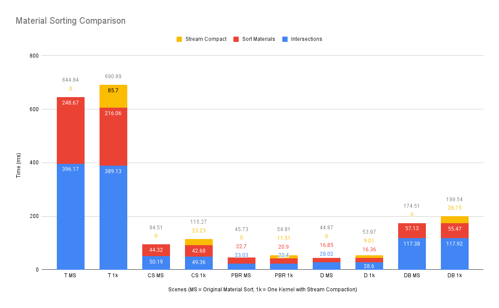
   
  <em>Comparison chart for Material Sorting methods</em>

While stream compaction adds back some performance, I was relieved to find that my extra overhead method is still actually faster, and the real bottleneck was the original thrust::sort_by_key. Some comparisons with thrust algorithms can be seen in my previous project on stream compaction, but I trust that they have very optimized methods, so I believe that material sorting is simply not worth it unless, for some reason, you have many more materials than I have.

Now, we have an important part missing from these charts, which is the timing of intersections.

